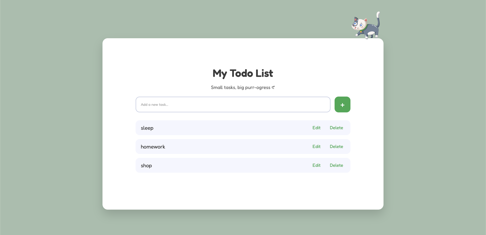

# Todo List App

A simple and fully functional Todo List web application built with vanilla JavaScript.

## Description
The Todo List App helps users manage their daily tasks efficiently. Users can add, edit, delete, and mark tasks as completed. All tasks are stored in the browser using localStorage, ensuring data persistence even after refreshing the page.

## Features
- Add new tasks
- Edit existing tasks
- Delete tasks
- Mark tasks as completed
- Persist tasks using localStorage

## Technologies Used
- HTML
- CSS
- JavaScript

## Vibe Coding Tool
- Cursor (AI-assisted code editor)

## Installation / Setup Instructions
1. Clone or download the repository.
2. Open the project folder on your local machine.

No additional installation or dependencies are required.

## How to Run the Project
Open the `index.html` file in any modern web browser (Chrome, Firefox, Edge, etc.).

## AI Usage
Cursor was used as a coding assistant to help write, refactor, and improve the code.  
All generated code was reviewed, tested, and simplified by the developer to ensure clarity and correctness.

## Credits and Acknowledgments
- Cursor AI for coding assistance and productivity support

## Screenshot

